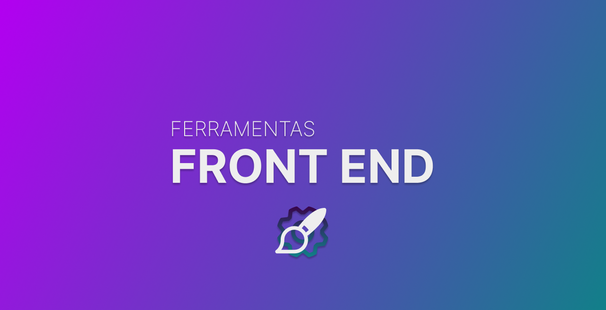

## Ferramentas Frontend

Este repositório foi criado com o objetivo de auxiliar você, desenvolvedor. Muitas vezes, ao iniciar um novo projeto, surge a dúvida sobre quais ferramentas utilizar. Ou, em alguns casos, você pode querer desenvolver algo mais complexo, mas não tem conhecimento de soluções práticas que economizam tempo.

Neste espaço, disponibilizarei as ferramentas que mais utilizo em diversas situações, sempre provando-se muito úteis. Espero que esses recursos facilitem o seu trabalho. ❤️

## Contibuições

Interessado em contribuir para o projeto? Faça um fork e abra um Pull Request. Vamos nessa! 👊🏽

## indice

* [Cores](#cores)
* [Ícones](#icones)
* [CSS](#css)
* [Ferramentas para Design](#ferramentasdesign)
* [Sombras](#sombras)
* [Inspirações](#inspiracoes)
* [Fontes](#fontes)
* [Animações - JS](#animacoesjs)
* [Extensões do chrome](#extensoes)
* [Hospedagens](#hospedagens)
* [Desafios](#desafios)
* [UI Kits](#uikits)
* [Imagens](#imagens)
* [Plugins Figma](#pluginsfigma)

##  Cores
Link | | 
|---|---|
| [Tint & Shade Generator](https://maketintsandshades.com/) | |
| [Color Hunt](https://colorhunt.co/) | |
| [Color Mind](http://colormind.io) | |
| [Adobe Color](https://color.adobe.com/pt/create/color-wheel) | |
| [Color palette generator](https://www.canva.com/colors/color-palette-generator/) | |
| [HTML Color Codes](https://htmlcolorcodes.com/) | |
| [Color Designer](https://colordesigner.io/) | |
| [Color Curves](https://colorcurves.app/) | |
| [Colorable](https://colorable.jxnblk.com/0c345a/00ffa2) | |
| [Khroma](https://www.khroma.co/) | |
| [0to255](https://0to255.com/) | |
| [Coolors](https://coolors.co/) | |
| [Radix UI Colors](https://www.radix-ui.com/colors/docs/overview/installation) | |

**[⬆ Voltar para o indice](#indice)**

##  Ícones
Link | | 
|---|---|
| [Material](https://material.io/resources/icons/) | |
| [Box Icons](https://boxicons.com/) | |
| [The Noun Project](https://thenounproject.com/) | |
| [Simple Icons](https://simpleicons.org/) | |
| [Ion Icons](https://ionicons.com/) | |
| [Flat Icon](https://www.flaticon.com/) | |
| [Feather Icons](https://feathericons.com/) | |
| [ICONS8](https://icons8.com.br/) | |
| [Font Awesome](https://fontawesome.com/) | |
| [Icon Finder](https://www.iconfinder.com/) | |
| [Css](https://css.gg/) | |
| [Icon scout](https://iconscout.com/) | |

**[⬆ Voltar para o indice](#indice)**

##  CSS
Link | | 
|---|---|
| [Animista](https://animista.net/) | |
| [Xs Games](https://xsgames.co/animatiss/) | |
| [Animate](https://animate.style/) | |
| [Minimamente](https://www.minimamente.com/project/magic/) | |
| [Hover](https://ianlunn.github.io/Hover/) | |
| [WickedCSS animations](https://kristofferandreasen.github.io/wickedCSS/) | |
| [Use Animations](https://useanimations.com/) | |
| [Image Hover](http://imagehover.io/) | |
| [zzz](https://zzz.dog/) | |
| [Csshake](https://elrumordelaluz.github.io/csshake/) | |

**[⬆ Voltar para o indice](#indice)**

##  Ferramentas para Design
Link | | 
|---|---|
| [Vectr](https://vectr.com/) | |
| [Taler](https://www.taler.app/) | |
| [Canva](https://www.canva.com/pt_br/) | |
| [Get Waves](https://getwaves.io/) | |
| [Bennett Feely](https://bennettfeely.com/clippy/) | |
| [POINT FULL CONTROL](https://9elements.github.io/fancy-border-radius/full-control.html) | |
| [Fotor](https://www.fotor.com/) | |
| [VEED.IO](https://www.veed.io/tools/video-editor) | |
| [Remove BG](https://www.remove.bg/pt-br) | |
| [Whimsical](https://whimsical.com/) | |
| [Octopus](https://octopus.do/) | |
| [Click Minded](https://www.clickminded.com/button-generator/) | |
| [Blob Maker](https://www.blobmaker.app/) | |
| [Photopea](https://www.photopea.com/) | |
| [Diagrams](https://www.diagrams.net/) | |
| [Grid Malven](https://grid.malven.co/) | |
| [Flexbox Malven](https://flexbox.malven.co/) | |
| [Neumorphism](https://neumorphism.io/#55b9f3) | |
| [DB Designer](https://www.dbdesigner.net/) | |
| [UI Bakery](https://uibakery.io/) | |
| [CSS Arrow Please](https://cssarrowplease.com/) | |
| [Glass UI](https://ui.glass/generator) | |
| [Glassmorphism Generator](https://hype4.academy/tools/glassmorphism-generator) | |
| [Laws of UX](https://lawsofux.com/) | |
| [Checklist Design](https://www.checklist.design/) | |
| [Tiny Png](https://tinypng.com/) | |
| [Image Compressor](https://imagecompressor.com/) | |
| [Compressor](https://compressor.io/) | |
| [Squoosh](https://squoosh.app/) | |

**[⬆ Voltar para o indice](#indice)**

##  Sombras
Link | | 
|---|---|
| [Smooth Shadow](https://shadows.brumm.af/) | |

**[⬆ Voltar para o indice](#indice)**

##  Inspirações
Link | | 
|---|---|
| [Behance](https://www.behance.net/) | |
| [Dribbble](https://dribbble.com/) | |
| [Httpster](https://httpster.net/2021/jan/) | |
| [Design Notes](https://www.designnotes.co/) | |
| [Hover](https://land-book.com/) | |
| [Frontend Mentor](https://www.frontendmentor.io/) | |
| [Awwwards](https://www.awwwards.com/) | |
| [Codrops](https://tympanus.net/codrops/) | |
| [Screen Lane](https://screenlane.com/) | |
| [Lapa](https://www.lapa.ninja/) | |
| [Media Queri](https://mediaqueri.es/) | |
| [Web Design](https://www.webdesign-inspiration.com/) | |
| [UI Garage](https://uigarage.net/) | |
| [Rauno](https://rauno.me/craft) | |

**[⬆ Voltar para o indice](#indice)**

##  Fontes
Link | | 
|---|---|
| [Google Fonts](https://fonts.google.com/) | |
| [Adobe Fonts](https://fonts.adobe.com/) | |

**[⬆ Voltar para o indice](#indice)**

##  Animações - JS
Link | | 
|---|---|
| [Swiper](https://swiperjs.com/) | |
| [barba](https://barba.js.org/) | |
| [slick](https://kenwheeler.github.io/slick/) | |
| [Particles](https://vincentgarreau.com/particles.js/) | |
| [Tilt](https://gijsroge.github.io/tilt.js/) | |
| [GSAP](https://gsap.com/) | |
| [mo.js](https://mojs.github.io/) | |
| [shadcn](https://ui.shadcn.com/) | |

**[⬆ Voltar para o indice](#indice)**

##  Desafios
Link | | 
|---|---|
| [Hacker Rank](https://www.hackerrank.com/) | |
| [Code Wars](https://www.codewars.com/) | |
| [Flexbox Froggy](https://flexboxfroggy.com/) | |
| [Flexbox Defense](http://www.flexboxdefense.com/) | |
| [Frontend Mentor](https://www.frontendmentor.io/challenges) | |
| [Codante](https://codante.io/) | |

**[⬆ Voltar para o indice](#indice)**

##  UI Kits
Link | | 
|---|---|
| [UI Deck](https://uideck.com/) | |
| [Splawr](https://splawr.com/) | |
| [W3 Layouts](https://w3layouts.com/) | |
| [Bootstrap Taste](https://bootstraptaste.com/) | |
| [Ecomm Design](https://ecomm.design/ecommerce-website-templates/) | |
| [Cruip](https://cruip.com/free-templates/) | |
| [Start Bootstrap](https://startbootstrap.com/) | |
| [Spline Sesign](https://spline.design/) | |
| [Tremor](https://www.tremor.so/) | |

**[⬆ Voltar para o indice](#indice)**

##  Imagens
Link | | 
|---|---|
| [Pexels](https://pexels.com) | |
| [Pixabay](https://pixabay.com/pt/) | |
| [Unsplash](https://unsplash.com/) | |
| [Gratisography](https://gratisography.com/) | |
| [Foodiesfeed](https://www.foodiesfeed.com/) | |
| [Freepik](https://br.freepik.com/) | |
| [Picography](https://picography.co/) | |

**[⬆ Voltar para o indice](#indice)**

##  Hospedagens
Link | | 
|---|---|
| [Vercel](https://vercel.com/) | |
| [Netlify](https://www.netlify.com/) | |
| [Github Pages](https://pages.github.com/) | |

**[⬆ Voltar para o indice](#indice)**

##  Plugins Figma
Link | | 
|---|---|
| [Shadowkit](https://www.figma.com/community/plugin/744987207861965946) | |
| [Blobs](https://www.figma.com/community/plugin/739208439270091369) | |
| [Content Reel](https://www.figma.com/community/plugin/731627216655469013) | |
| [Brandfetch](https://www.figma.com/community/plugin/733590967040604714) | |
| [Stark - Contrast & Accessibility Tools](https://www.figma.com/community/plugin/732603254453395948) | |
| [Color Palettes](https://www.figma.com/community/plugin/740832935938649295) | |
| [Autoflow](https://www.figma.com/community/plugin/733902567457592893) | |
| [UI Faces](https://www.figma.com/community/plugin/769664006254845172) | |
| [Calendar - Auto Layout](https://www.figma.com/community/file/806493111803401210) | |
| [Contra Wireframe Kit](https://www.figma.com/community/file/833515051385038928) | |
| [MEMOJI](https://www.figma.com/community/file/895239514338276669) | |

**[⬆ Voltar para o indice](#indice)**

🚧 Em Construção 🚧

